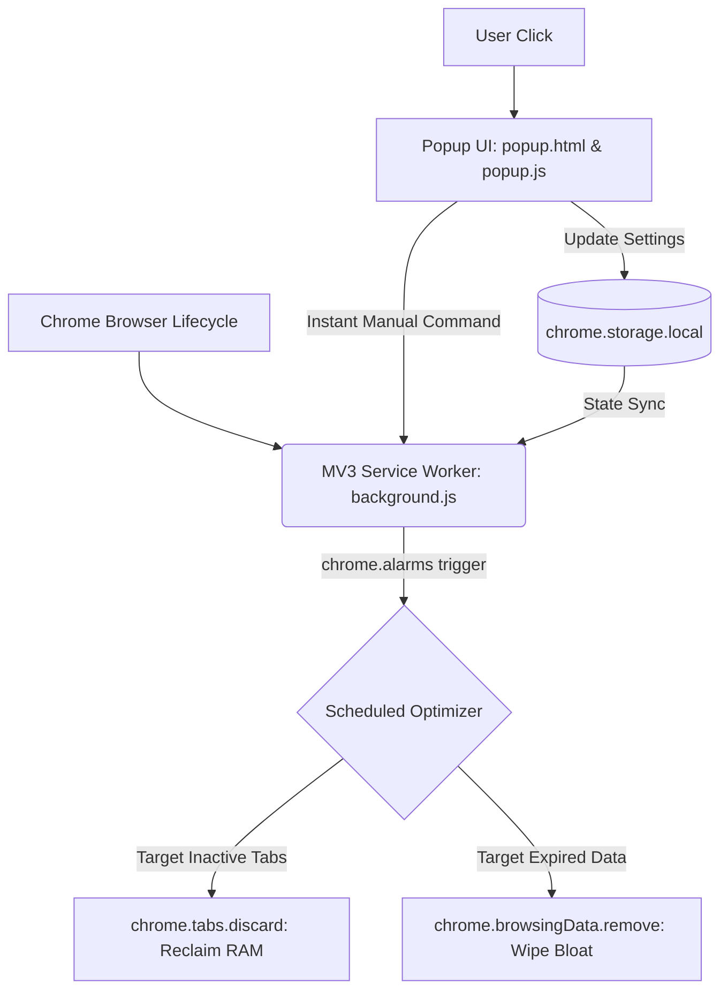

# 🧹 Auto Clear & Optimize Pro — Chrome Extension (v2.3)

<div align="center">

[](LICENSE)
[](https://developer.chrome.com/docs/extensions/mv3/intro/)
[](https://github.com/Kamran5H/AutoClearExtension)
[](https://github.com/Kamran5H/AutoClearExtension)
[](https://github.com/Kamran5H/AutoClearExtension)

**A high-performance Chrome Manifest V3 extension that cleans cache, history, and cookies on automated schedules while aggressively reclaiming memory from idle tabs.**

[Features](#-features) • [Installation](#-installation) • [Architecture](#-architecture) • [Configuration](#-configuration) • [License](#-license)

</div>

---

## 🌟 Executive Overview

**Auto Clear & Optimize Pro** is a lightweight, zero-bloat browser utility built strictly according to Google Chrome's **Manifest V3** specification. Designed for power users, developers, and privacy-conscious professionals, it prevents memory leaks and browser bloat by:
1. Reclaiming system RAM through intelligent background tab discarding.
2. Automating cache, browsing history, download records, and cookie purges on configurable alarms.
3. Guaranteeing 100% local operation with zero remote telemetry or external analytics.

---

## 🚀 Features

- **⏰ Automated Scheduled Purging**: Configurable background timer via `chrome.alarms` to clear cache and history at intervals (15m, 1h, 4h, 24h, or on browser startup).
- **🧠 Tab RAM Optimizer (`chrome.tabs.discard`)**: Identifies idle background tabs exceeding inactivity thresholds and suspends their JavaScript execution context without closing them.
- **🛡️ Granular Cleaning Toggles**: Select exactly what to wipe:
  - Cache Storage & Service Worker caches
  - Browsing History & Search Logs
  - Cookies & Local Site Data
  - Download History records
  - FormData & Autofill entries
- **🎨 Sleek Dark-Mode Popup**: Clean, responsive UI with immediate feedback badges, system status indicators, and one-tap manual wipe triggers.
- **⚡ Manifest V3 Compliant**: Uses persistent state in `chrome.storage.local` and event-driven Service Workers to ensure near-zero idle CPU consumption.

---

## 🏗️ Architecture



---

## 📁 Repository Structure

```text
AutoClearExtension/
├── manifest.json       # Manifest V3 configuration & permission boundaries
├── background.js       # Background service worker with alarms & cleanup routines
├── popup.html          # Modern dark-mode extension popup interface
├── popup.js            # Frontend event handling & storage synchronization
├── .gitignore          # Package and artifact exclusions
└── LICENSE             # Open-source MIT License
```

---

## ⚡ Installation Guide

1. Clone or download this repository:
   ```bash
   git clone https://github.com/Kamran5H/AutoClearExtension.git
   ```
2. Open Google Chrome and navigate to `chrome://extensions/`.
3. Enable **Developer mode** using the toggle switch in the top-right corner.
4. Click **Load unpacked** and select the `AutoClearExtension` directory.
5. Pin **Auto Clear & Optimize Pro** to your Chrome toolbar for easy access!

---

## 📜 License

This project is open-source and released under the [MIT License](LICENSE).  
Copyright (c) 2024-2026 **Kamran Ashraf**.
